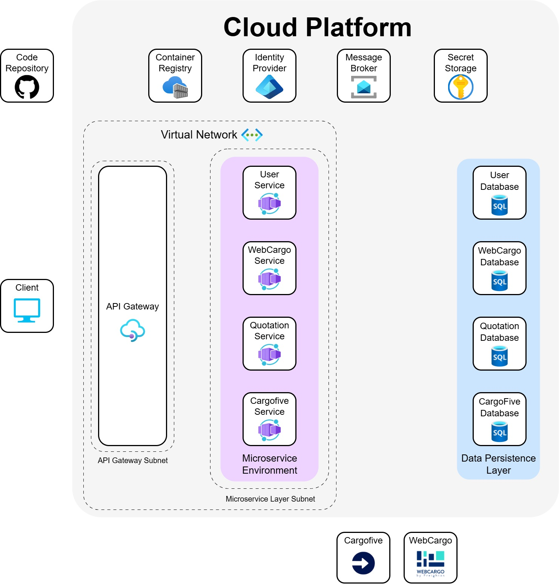
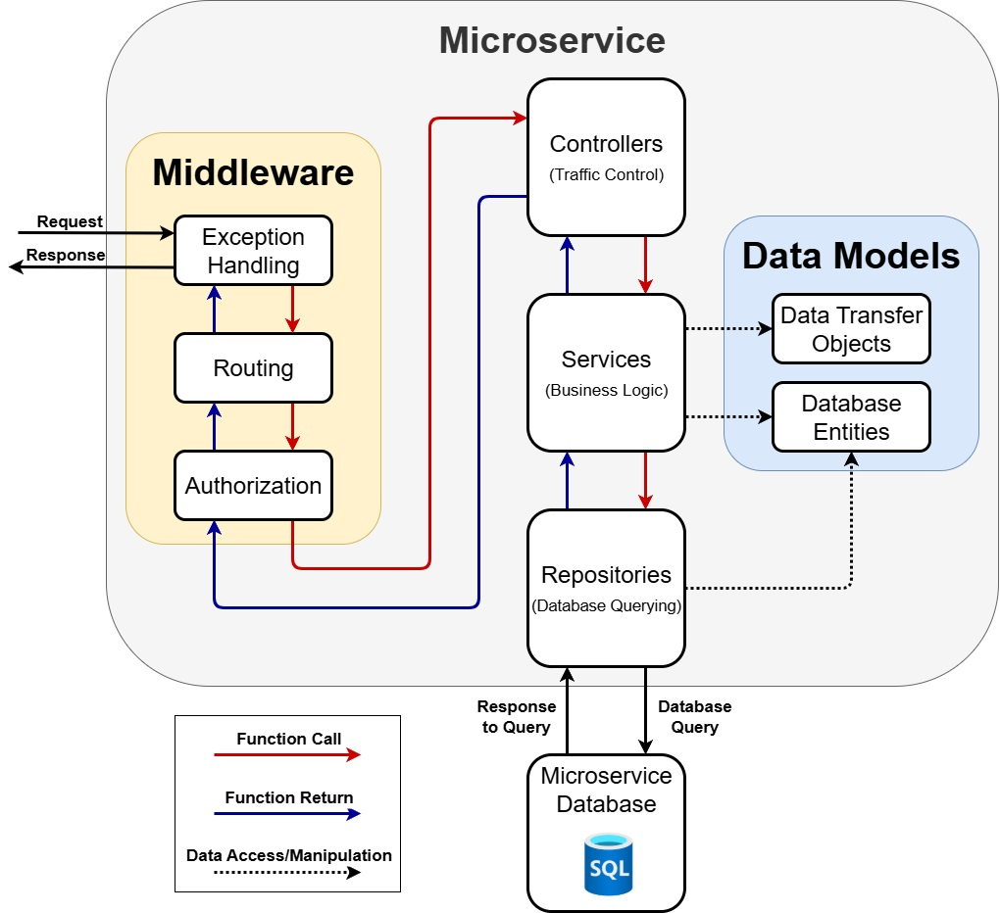
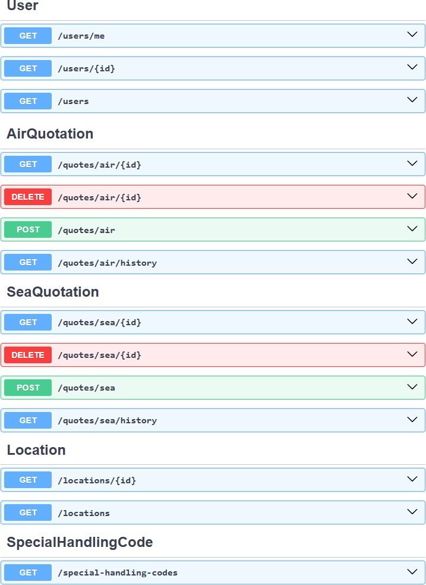

# Freight Quotation Web API

The main objetive of this API is to provide freight quotes to users by querying external carrier APIs (WebCargo and Cargofive) for freight rates and applying business logic.

# High-Level Architecture

# Internal Microservice Architecture

# API Endpoints

